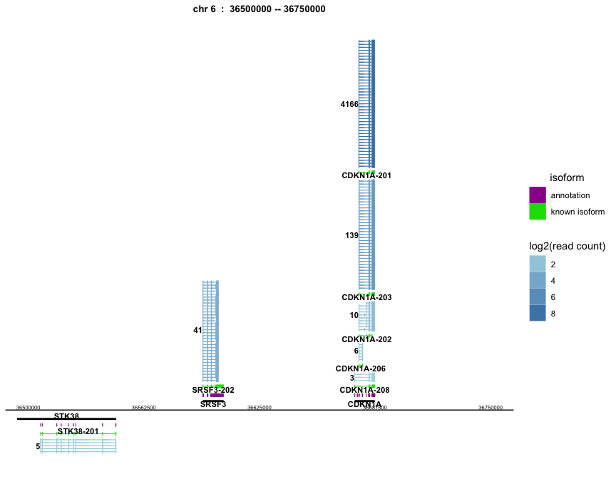
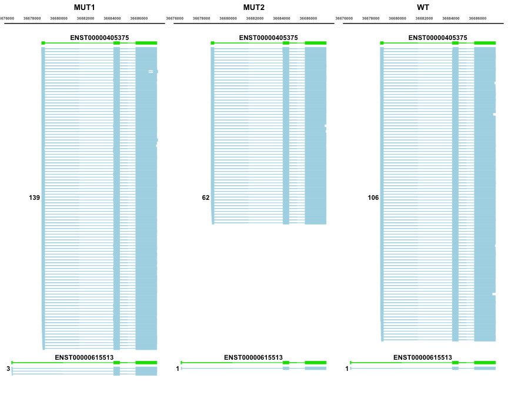
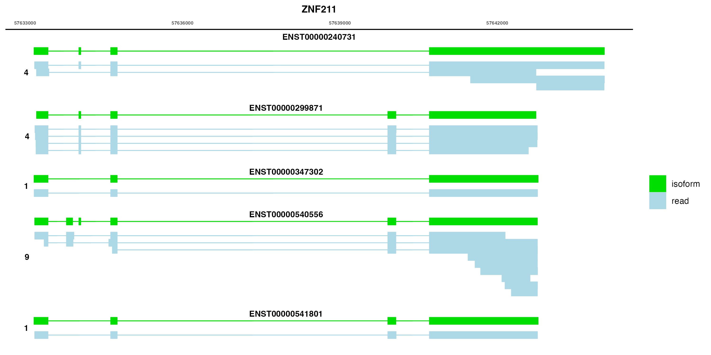
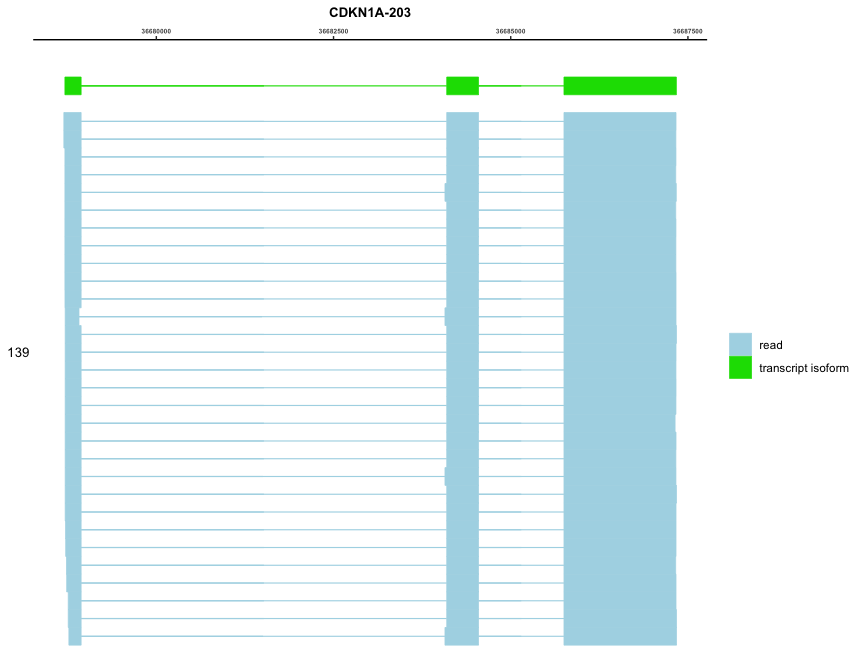

# txviz
`txviz` is an R package for visualizing exon and intron structural differences between different transcripts.

## Installation

``` r
# you can install the development version of txviz from GitHub:
# install.packages("devtools")
devtools::install_github("wwei-lab/txviz")
```
## Usage
The four visualization methods implemented by `txviz` are used to show the differences between different transcripts, which are `multi_gene()`，`samples_comp()`，`single_gene()`,`single_transcript()`.

### Input data
To use txviz, you should provide:
* A reference gene annotation in GTF format,like Homo_sapiens.GRCh38.109.chr.gtf. Here we provide the filtered Homo_sapiens GRCh38.109.chr.gtf data, named the `annotation`.
* Several read annotation files for the reference genome, in Bed format.We provide several sample data with read annotations, named `MUT1_read`,`MUT2_read`,`WT_read`.
* A mapping file of transcirpt and read, which can be stored as data.frame data, needs to contain 'transcript_id' and 'name' columns, where the 'name' column represents 'readID'.Here we provide the mapping file,named the `readmap`.
### multi_gene()
Drawing the transcript exon and intron structure of multiple genes at a large scale.
* Key Parameters

|key parameter|description|
|---|---|
|annotation| A Gtf format data,imported into GRanges object.The data need to contain the column name of "transcript_id","gene_name","type","gene_id",etc.|
|read| A bed format data after alignment with the genome,imported into GRanges object.The data need to contain the column name of "name" as the readID.|
|readmap| A mapping file of transcirpt and read, which can be stored as data.frame data, needs to contain 'transcript_id' and 'name' columns, where the 'name' column represents 'readID'.|
|novel_transcript_ids| A dataframe with the column name needs to contain ‘novel_transcript_id’ to mark the color of novel isoform.|
|chr| The chromosome of interest,such as chr="6".|
|range| The range of interest,such as range=c(36000000,36700000).|
|strand| The strand of interest,such as strand="+" or "-" or "both";the default value is "both".|
|limit| To limit the number of read displays. If the read count exceeds the limit value, the limit+log2(read count-limit)  number of reads will be randomly selected.|
* Style Parameters
  
|style parameter|description|
|---|---|
|read_low_color| The color is the minimum number of reads.|
|read_high_color| The color is the maximum number of reads.|
|annotation_color| The annotation exon color in the gtf format data.|
|novel_isoform_color| The annotation exon color in the gtf format data.|
|known_isoform_color| Mark the color of the known transcript isoform.|
|text_color| The font color of transcript name.|
|text_size| The font size of tittle name.|
|text_alpha| The font transparency of transcript name.|
|text_fontface| The font shape of transcript name.|
|title_color| The font color  of tittle name.|
|title_size| The font size of tittle name.|
|title_face| The font shape of tittle name.|
|num_color| The font color of read number.|
|num_size| The font size of read number.|
|num_alpha| The font transparency of read number.|
|num_fontface| The font shape of read number.|
|num_margin| The read numbe moves to the left.|
|show_transcript_name| Whether the transcript name is displayed in the plot.The default is FALSE|
|x_text_size| The text size of x-axis.|
|x_text_just| Adjust the x-axis text position|

* Output
  return a ggplot2 object
* Test Code
``` r
multi_gene(annotation,MUT1_read,readmap,chr='6',strand="both",range=c(36500000,36750000),limit=30,show_transcript_name=)
```


### samples_comp()
Comparison of transcript isoforms structural differences between multiple samples.
* Key Parameters

|key parameter|description|
|---|---|
|annotation| A Gtf format data,imported into GRanges object.The data need to contain the column name of "transcript_id","gene_name","type","gene_id",etc.|
|readlist| A list object with the read data of multiple samples and the read data stored as GRanges object.The every read data need to contain the column name of "name" as the readID.|
|readmap| A mapping file of transcirpt and read, which can be stored as data.frame data, needs to contain 'transcript_id' and 'name' columns, where the 'name' column represents 'readID'.|
|interest_transcript_ids| A dataframe with the column name needs to contain 'interest_transcript_id' to choose what you want to show transcript isoform. The order of the interest transcript id is related to the order of the drawing|
|novel_transcript_ids| A dataframe with the column name needs to contain 'novel_transcript_id' to mark the color of novel isoform.|
|limit| To limit the number of read displays. If the read count exceeds the limit value, the limit+log2(read count-limit)  number of reads will be randomly selected.|
* Style Parameters
  
|style parameter|description|
|---|---|
|text_color| The font color of transcript name.|
|text_size| The font size of tittle name.|
|text_alpha| The font transparency of transcript name.|
|text_fontface| The font shape of transcript name.|
|title_color| The font color  of tittle name.|
|title_size| The font size of tittle name.|
|title_face| The font shape of tittle name.|
|num_color| The font color of read number.|
|num_size| The font size of read number.|
|num_alpha| The font transparency of read number.|
|num_fontface| The font shape of read number.|
|num_margin| The read numbe moves to the left.|
|show_transcript_name| Whether the transcript name is displayed in the plot.The default is FALSE|
|x_text_size| The text size of x-axis.|

* Output
  
  return a ggplot2 object
* Test Code
  
``` r
#You need to name the elements in the list, which are related to the graph.
readlist=list("MUT1"=MUT1_read,"MUT2"=MUT2_read,"WT"=WT_read)
#The order of the interest transcript id is related to the order of the drawing.
interest_transcript_ids=data.frame(interest_transcript_id=c("ENST00000405375","ENST00000615513"))
samples_comp(annotation=annotation,readlist=readlist,readmap=readmap,limit=100,interest_transcript_ids=interest_transcript_ids)
```


### single_gene()
Drawing the transcript exon and intron structure of a gene in the range.
* Key Parameters

|key parameter|description|
|---|---|
|annotation| A Gtf format data,imported into GRanges object.The data need to contain the column name of "transcript_id","gene_name","type","gene_id",etc.|
|read| A bed format data after alignment with the genome,imported into GRanges object.The data need to contain the column name of "name" as the readID.|
|readmap| A mapping file of transcirpt and read, which can be stored as data.frame data, needs to contain 'transcript_id' and 'name' columns, where the 'name' column represents 'readID'.|
|chr| The chromosome of interest,such as chr="6".|
|range| The range of interest,such as range=c(36000000,36700000).|
|strand| The strand of interest,such as strand="+" or "-" or "both";the default value is "both".|
|limit| To limit the number of read displays. If the read count exceeds the limit value, the limit+log2(read count-limit)  number of reads will be randomly selected.|
* Style Parameters
  
|style parameter|description|
|---|---|
|read_color| Displays the color of the read structure.|
|isoform_color| Displays the color of the transcript isoform structure|
|text_color| The font color of transcript name.|
|text_size| The font size of tittle name.|
|text_alpha| The font transparency of transcript name.|
|text_fontface| The font shape of transcript name.|
|title_color| The font color  of tittle name.|
|title_size| The font size of tittle name.|
|title_face| The font shape of tittle name.|
|num_color| The font color of read number.|
|num_size| The font size of read number.|
|num_alpha| The font transparency of read number.|
|num_fontface| The font shape of read number.|
|num_margin| The read numbe moves to the left.|
|show_transcript_name| Whether the transcript name is displayed in the plot.The default is FALSE|
|x_text_size| The text size of x-axis.|

* Output
  
  return a list object with ggplot2.
* Test Code
  
``` r
#
p_list=single_gene(annotation,MUT1_read,readmap,chr='6',strand="+",range=c(36050000,36700000),show_transcript_name=TRUE)
p_list[[1]]
```


### single_transcript()
Drawing the exon and intron structure of interest transcript isoform.
* Key Parameters

|key parameter|description|
|---|---|
|annotation| A Gtf format data,imported into GRanges object.The data need to contain the column name of "transcript_id","gene_name","type","gene_id",etc.|
|read| A bed format data after alignment with the genome,imported into GRanges object.The data need to contain the column name of "name" as the readID.|
|readmap| A mapping file of transcirpt and read, which can be stored as data.frame data, needs to contain 'transcript_id' and 'name' columns, where the 'name' column represents 'readID'.|
|interest_transcript_id| A string data as the interest transcript_id.| 
|limit| To limit the number of read displays. If the read count exceeds the limit value, the limit+log2(read count-limit)  number of reads will be randomly selected.|
* Style Parameters
  
|style parameter|description|
|---|---|
|read_color| Displays the color of the read structure.|
|isoform_color| Displays the color of the transcript isoform structure|
|title_color| The font color  of tittle name.|
|title_size| The font size of tittle name.|
|title_face| The font shape of tittle name.|
|num_size| The font size of read number.|
|show_transcript_name| Whether the transcript name is displayed in the plot.The default is FALSE|
|x_text_size| The text size of x-axis.|

* Output
  
  return a ggplot2 object
* Test Code
  
``` r
#
single_transcript(annotation,MUT1_read,readmap,"ENST00000405375")
```

